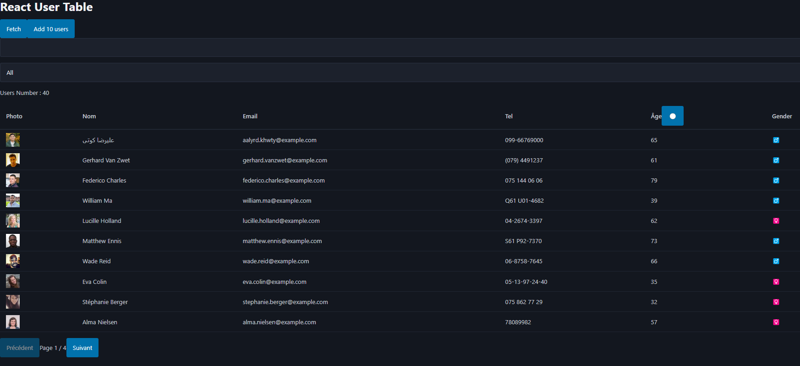

# React + Vite
* By *Okome Solène Data engineer M2*
## 📂 Project Overview 

Migrated a vanilla HTML/JS user directory to React, adding advanced data management features while preserving core functionality.




## 📂 Key Features  

### View Enhancements
- Added gender column and replaced text labels with symbols (♂️/♀️/⚧️)
- Added display of filtered profiles count 

### Data Filtering
- Search by name (partial match and special characters supported)
- Filter by gender (male/female/all)

### Sorting
- Age sorting (ascending/descending)
- Toggle between sort states with visual indicators

### Pagination
- 10 results per page 
- URL synchronization (`?page=2`)
- Page navigation controls

### Data Management
- "Load 10 more" button (non-destructive)
- State persistence on page refresh
- Shareable URLs preserve all filters


## 📂 Installation and Launch

### Clone the project
```sh
git clone https://github.com/Floyd2001/React_first_project.git

```
### Install dependencies
If this is **your first time installing the project**, run the following command to get all the necessary libraries: :

```sh
npm install
```

### Start the local server
To view the resulting page, run:

```sh
npm run dev
```


This template provides a minimal setup to get React working in Vite with HMR and some ESLint rules.

Currently, two official plugins are available:

- [@vitejs/plugin-react](https://github.com/vitejs/vite-plugin-react/blob/main/packages/plugin-react/README.md) uses [Babel](https://babeljs.io/) for Fast Refresh
- [@vitejs/plugin-react-swc](https://github.com/vitejs/vite-plugin-react-swc) uses [SWC](https://swc.rs/) for Fast Refresh
